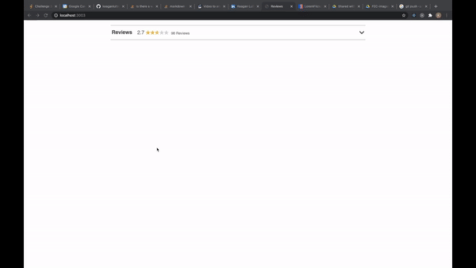
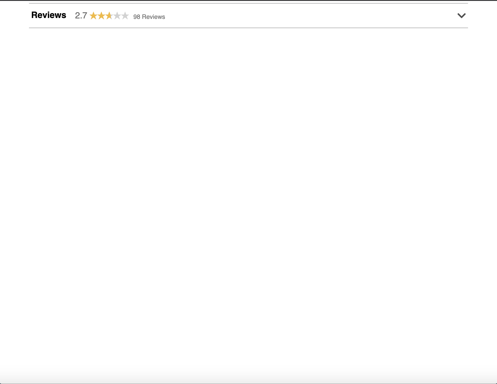
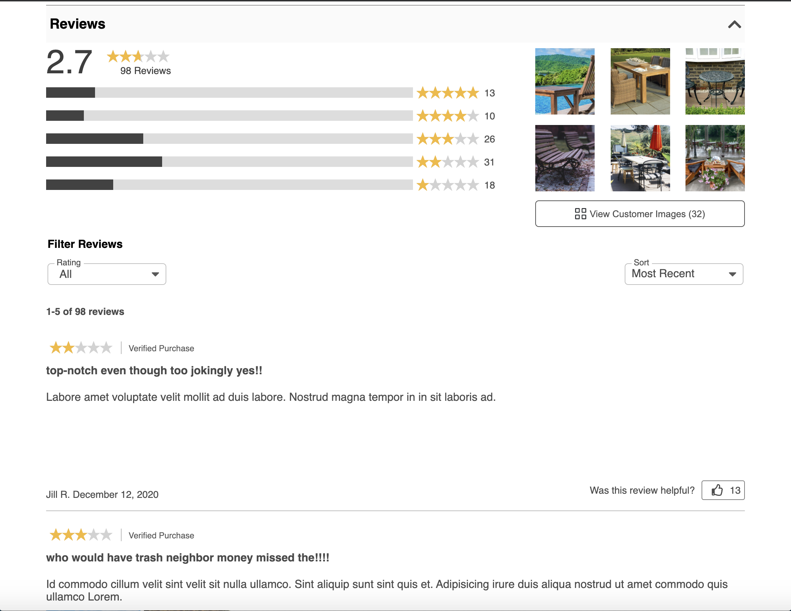
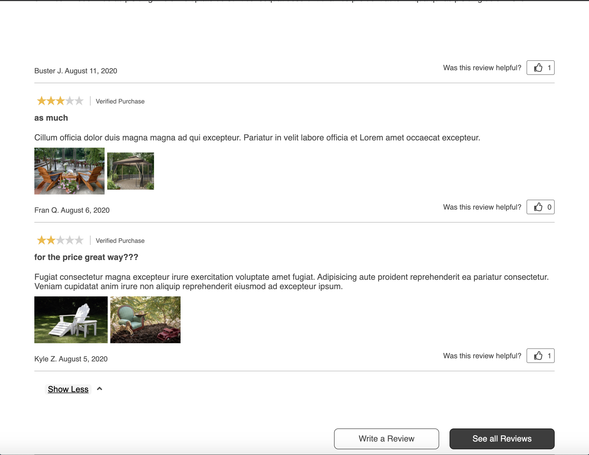
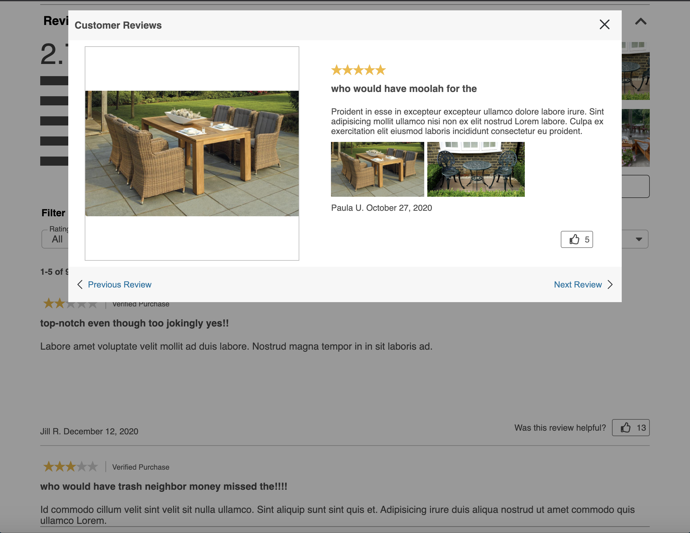

# Reviews-Service



## About

This application uses service oriented architecture and is designed to be a module of a larger web application.  This service encompasses what you would see in any major e-commerce website today.  It can handle meta data, reviews, filters by rating, sort by most helpful or most recent and displays a gallery modal as well. This service was built with React, Express, and MongoDB.

## Installation

To get started install the packages!

```
npm install
```

then seed the database

```
npm run seed
```

then to bundle this application run:

```
npm run build
```

then start the server!

```
npm start
```

Navigate to http://localhost:3003/ to see the page in action

To test run:

```
npm test
```

## Screenshots




